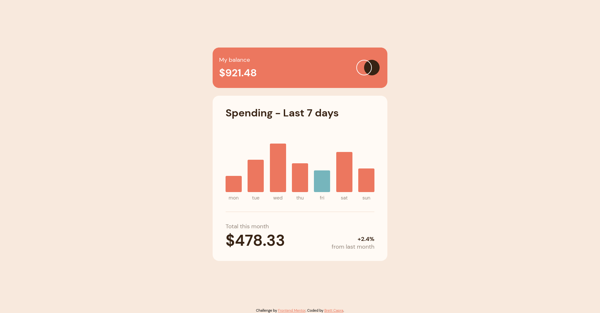

# Expenses chart component - Frontend Mentor solution

This is a solution to the [Expenses chart component challenge on Frontend Mentor](https://www.frontendmentor.io/challenges/expenses-chart-component-e7yJBUdjwt). 

This project was bootstrapped with [Create React App](https://github.com/facebook/create-react-app).

## Overview

### Project Goals

Users should be able to:

- View the bar chart and hover over the individual bars to see the correct amounts for each day
- See the current day’s bar highlighted in a different colour to the other bars
- View the optimal layout for the content depending on their device’s screen size
- See hover states for all interactive elements on the page
- Use the JSON data file provided to dynamically size the bars on the chart

### Screenshots

### Links

- Solution: [Frontend Mentor]()
- Live Site: [bcapra.com](https://www.bcapra.com/expense-chart)

## Development Process

### Built With

- [React](https://reactjs.org/)
- Flexbox
- Mobile-first workflow

### What I learned

While I initially thought I knew what 'mobile-first' development meant, I realized I was sorely mistaken on my last mobile responsive project and spent hours refactoring CSS. This time around, I've implemented a true mobile-first process that made working with the media queries far less time consuming.

Given this is one of my first React projects, I've been learning a ton about React as I go, and getting more proficient with the process of developing UIs through a framework rather than coding them from scratch. There are still some growing pains, and I think I'll explore other frameworks like Svelte alongside React as I continue.

Additionally, working with React also meant learning how to deploy my React App on Github Pages for the first time. While this process is probably mundane to most, I thought the idea of 'deploying' the new build in my local repository, pushing it to the remote, and having the remote create a new branch with static assets to deploy was super interesting. 

## Author

- Website - [Brett Capra](https://www.bcapra.com)
- Frontend Mentor - [@b-capra](https://www.frontendmentor.io/profile/b-capra)